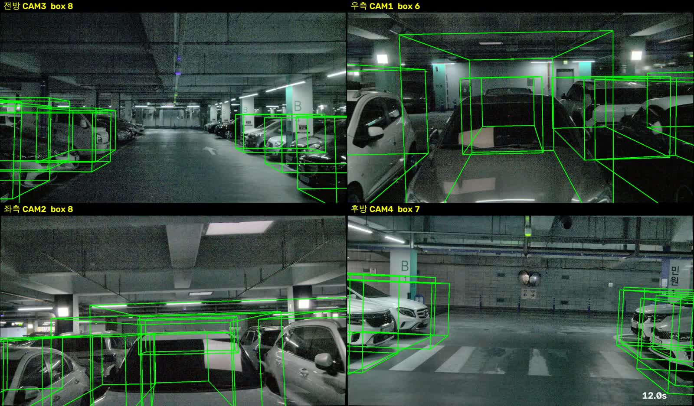
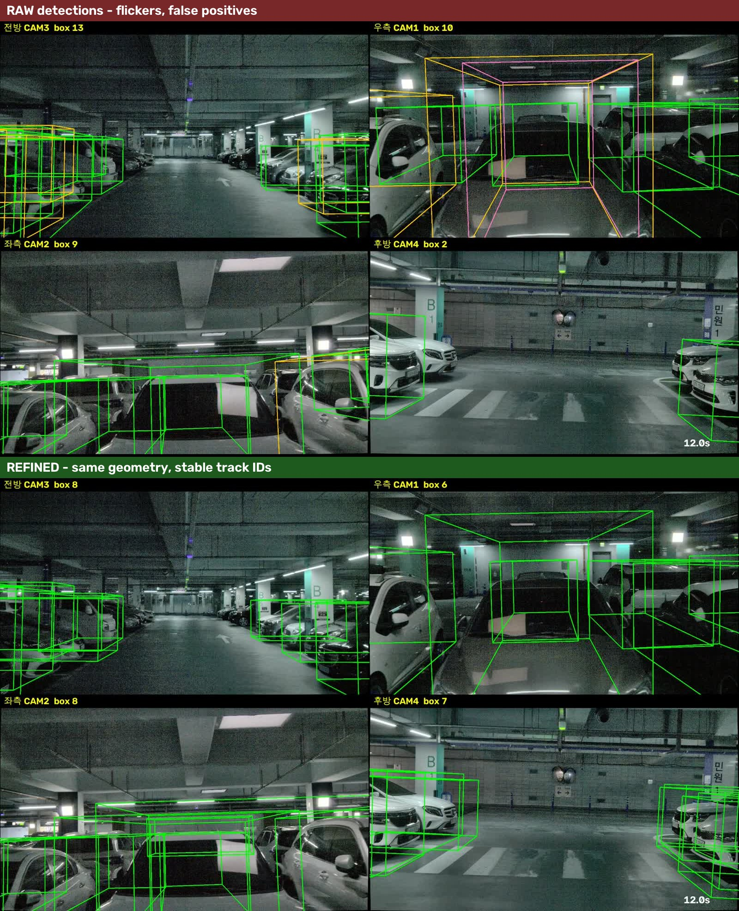

# session_025 — 4 ~ 11 단계 기록

경북대학교 글로벌플라자 주차장 (지하 B1) · 25 초 녹화 (앞 5 초 정지 + 20 초 직진 주행) · free-run

전체 순서와 단계 정의는 [최상위 README](../README.md) 를 본다. 이 문서는 **session_025 에 적용한 설정과 결과**만 적는다. session_031 기록은 [`session_031/README.md`](../session_031/README.md) 에 있다.

| | 단계 | 상태 | 완료 |
|---|---|---|---|
| 4 | 포인트 보정 (deskew + 셔터 시각) | ✅ | 2026-10-03 00:28 |
| 5 | 이미지 변환 (밝기 보정) | ✅ | 2026-10-03 01:23 |
| 8 | KISS-ICP 드리프트 측정 | ✅ | 2026-10-03 16:38 |
| 9 | 키프레임 선별 (1 m 간격, 251 → 28) | ✅ | 2026-10-03 17:15 |
| 10 | **초안 다듬기** | ✅ | 2026-10-04 04:00 |
| 11 | 포맷 변환 (ReBound) | ✅ | 2026-10-04 04:00 |
| 12 | 툴 적재 확인 | ✅ | 2026-10-03 23:50 |
| 13 | 3D bounding box 라벨링 (사람) | ⬜ 진행 가능 | |

---

## 9. 키프레임 선별

`select_keyframes.py --min-dist 1.0 --max-gap 3.0` → 251 스캔 중 **28 장**.

session_025 는 앞 5 초가 정지 구간이라, 그 구간은 `max_gap 3.0 초` 규칙으로만 뽑힌다. 정지 중에는 같은 장면이 반복되므로 거리 기준이 걸리지 않는다.

## 10. 초안 다듬기

`refine_boxes.py` — 설정은 session_031 과 같다 ([설계와 근거](../session_031/README.md#10-초안-다듬기-신설)).

```bash
PYTHONPATH=<kiss-icp 환경> python3 데이터_라벨링/code/refine_boxes.py \
  ~/ros2_ws/cam_lidar_recording/sessions/session_025 \
  --poses 포인트보정/results/2026-10-02_session_025/deskew_on \
  --detections 포인트보정/results/2026-10-02_session_025/autolabel_s01/detections.json \
  -o 포인트보정/results/2026-10-02_session_025/autolabel_s01/refined.json
```

| | 내용 | 결과 |
|---|---|---|
| 1 | 월드 좌표로 모음 | 1,029 개 |
| 2 | BEV IoU 0.3 이상이면 같은 물체 | 132 군집 |
| 3 | 3 개 키프레임 미만 관측은 버림 | 64 개 버림 → 68 개 |
| 4 | 크기·방향 점수 가중 평균 (판별·전파용) | 트랙 대표값 |
| 5 | 박스 안 점의 최소 외접 사각형으로 재측정 | 63/68 적용 |
| 6 | 모양 검사 | 9 개 탈락 → **59 개** |
| 7 | 모든 키프레임에 다시 뿌림. **기하는 원본 검출 그대로**, 없는 프레임만 전파 | 원본 **599** · 전파 **416** |
| 8 | 트랙 ID 부여 | 59 개 |

**최종: 1,029 → 1,015 개 (프레임당 36.8 → 36.2), 물체 59 개**

지면 −1.89 m, 천장 2.94 m (데이터에서 자동 산출). 모양 검사 탈락 내역: 벽처럼 이어짐 4, 점 부족 4, 수직 구조물 1.

### session_031 과 다른 점

| | session_025 | session_031 |
|---|---|---|
| 주행 | 직진만 | 통로 회전 포함 |
| 원본 검출 (20 m 차량) | 1,029 | 690 |
| 물체(트랙) | **59** | 36 |
| 원본 기하 / 전파 | 599 / **416 (41 %)** | 393 / 148 (27 %) |
| 박스가 점을 감싸는 정도 (원본 → 다듬기) | 0.654 / 0.765 → 0.623 / 0.745 | 0.559 / 0.689 → 0.580 / 0.686 |

**전파 비율이 높을수록 맞춤 품질이 떨어진다.** 전파한 박스는 월드 평균에서 오는 것이라 ego pose 드리프트를 안고 있기 때문이다 (원본 기하를 쓰는 박스는 그 오차가 없다). session_025 는 직진이라 한 차를 오래 보고, 그만큼 검출이 빠진 프레임도 많아 전파 비율이 41 % 로 높다.

그래도 전파를 끄면 그 프레임에 박스가 아예 없어진다. **전파 박스 = 검출기가 놓친 자리를 메운 것**이고, 13 단계에서 사람이 먼저 확인할 대상이다.

## 11. 포맷 변환

`to_rebound.py` — 20 m · 차량 클래스만.

```
rebound/session_025/
├── bounding/0~27/boxes.json            1,015 개  ← 여기서 작업 (confidence 100)
├── pred_bounding/0~27/boxes.json       1,015 개  ← 비교용
└── pred_bounding_original/             1,015 개  ← 백업
```

박스 `id` 에 트랙 ID(`T000` …)가 들어가 **프레임이 바뀌어도 같은 차는 같은 ID** 다.

## 12. 툴 적재 확인

```bash
bash 데이터_라벨링/code/run_rebound.sh ~/ros2_ws/cam_lidar_recording/rebound/session_025
```

**"Toggle Predicted or GT" 를 Ground Truth 로 두고 작업한다.**

### 확인용 영상





확인용 영상은 **레포에 올리지 않는다** (용량). 로컬에서 본다:

```
~/ros2_ws/cam_lidar_recording/sessions/session_025/boxes_refined.mp4
```

다듬기 전 영상은 같은 폴더의 `boxes_20s.mp4` 다. 위 그림이 그 영상의 한 장면이다.
## 13 단계부터 할 일

사람이 ReBound 에서 박스를 고친다. 남은 오탐(벽·기둥·구조물)과 어긋난 박스는 **검출기 자체의 오차**이며 자동으로는 더 줄이지 못한다.
