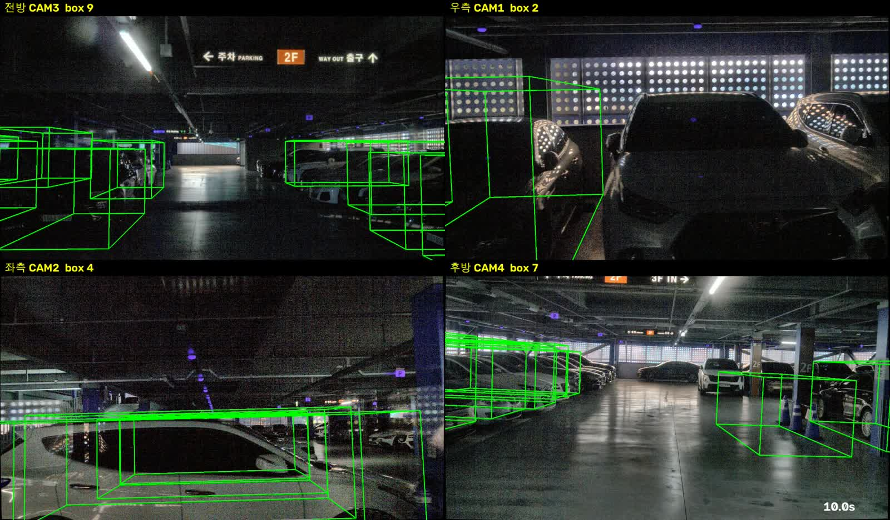

# session_030 — 4 ~ 11 단계 기록

대구공항 주차장 (실내) · 20 초 녹화 · free-run

전체 순서와 단계 정의는 [최상위 README](../README.md) 를 본다. 이 문서는 **session_030 에 적용한 설정과 결과**만 적는다. 설계 근거는 [`session_031/README.md`](../session_031/README.md) 에 한 번만 적어 두었다.

| | 단계 | 상태 | 완료 |
|---|---|---|---|
| 4 | 포인트 보정 (KISS-ICP deskew) | ✅ | 2026-10-04 |
| 9 | 키프레임 선별 | ✅ | 2026-10-04 |
| 10 | 초안 다듬기 | ✅ | 2026-10-04 |
| 11 | 포맷 변환 (ReBound) | ✅ | 2026-10-04 |
| 12 | 툴 적재 확인 | ⬜ | |
| 13 | 3D bounding box 라벨링 (사람) | ⬜ 진행 가능 | |

재현 명령은 한 줄이다.

```bash
bash 데이터_라벨링/code/run_session.sh 030 2026-10-04
```

## 4. 포인트 보정

`run_kiss_icp.py --voxel 0.2 --max-range 25` (실내용 설정, 8 단계에서 정한 값).

## 9. 키프레임 선별

직전 키프레임에서 **1 m 이상 움직였거나 3 초가 지나면** 선택.

| | |
|---|---|
| 키프레임 | **26 장** |

## 10. 초안 다듬기

| | 내용 | 결과 |
|---|---|---|
| 1 | 월드 좌표로 모음 | 978 개 |
| 2 | BEV IoU 0.3 이상이면 같은 물체 | 84 군집 |
| 3 | 3 개 키프레임 미만 관측은 버림 | 34 개 버림 → 50 개 |
| 4 | 크기·방향 점수 가중 평균 (판별·전파용) | 트랙 대표값 |
| 5 | 박스 안 점의 최소 외접 사각형으로 재측정 | 43/50 적용 |
| 6 | 모양 검사 | 9 개 탈락 → **41 개** |
| 7 | 모든 키프레임에 다시 뿌림. **기하는 원본 검출 그대로**, 없는 프레임만 전파 | 원본 **567** · 전파 **83** |
| 8 | 트랙 ID 부여 | 41 개 |

**최종: 978 → 650 개 (프레임당 37.6 → 25.0), 물체 41 개**

지면 -1.90 m, 천장 3.20 m (데이터에서 자동 산출).

**모양 검사 탈락 내역**

| 이유 | 개수 |
|---|---|
| 점부족 | 6 개 |
| 벽처럼 | 3 개 |

**전파 비율 13 %.** 전파한 박스는 월드 평균에서 오는 것이라 ego pose 드리프트를 안고 있다. 비율이 높을수록 맞춤 품질이 떨어지지만, 빼면 그 프레임에 박스가 아예 없어진다 — 검출기가 놓친 자리를 메운 것이고 13 단계에서 먼저 확인할 대상이다.

## 11. 포맷 변환

`to_rebound.py` — 20 m · 차량 클래스만. 검출기 원본 3293 개 중 20 m 이내 차량이 978 개다.

```
rebound/session_030/
├── bounding/0~25/boxes.json          650 개  ← 여기서 작업 (confidence 100)
├── pred_bounding/0~25/boxes.json     650 개  ← 비교용
└── pred_bounding_original/               650 개  ← 백업
```

용량 217M. 박스 `id` 가 곧 트랙 ID 라 **프레임이 바뀌어도 같은 차는 같은 ID** 다.

## 12. 툴 적재 확인

```bash
bash 데이터_라벨링/code/run_rebound.sh ~/ros2_ws/cam_lidar_recording/rebound/session_030
```

**"Toggle Predicted or GT" 를 Ground Truth 로 두고 작업한다.**

### 확인용 영상



[`검출박스_20초.mp4`](검출박스_20초.mp4) (6.0 MB). 원본 해상도는 `~/ros2_ws/cam_lidar_recording/sessions/session_030/boxes_refined.mp4` (109 MB).
