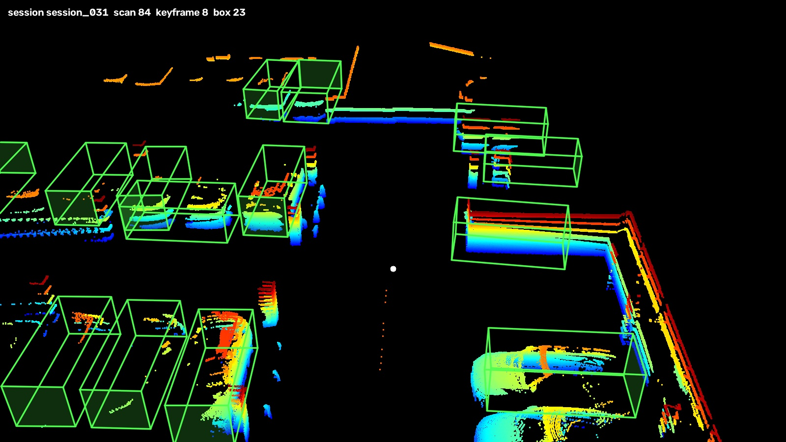

# session_031 — 라이다 단독 3D bounding box 파이프라인

대구공항 주차장 (실내) · 20 초 녹화 · 통로 회전 포함 · free-run

**2026-10-04 에 목표가 바뀌었다.** 카메라에 박스를 투영하는 것이 아니라 **포인트클라우드 자체에서 3D bounding box** 를 만드는 것이 목표다. 그에 따라 카메라가 필요한 단계를 전부 뺐다 (아래 "뺀 단계" 참고).

---

## 단계

| | 단계 | 상태 | 완료 |
|---|---|---|---|
| 1 | 녹화 (VLP-16) | ✅ | 2026-10-02 |
| 2 | **포인트 보정 · 오도메트리** (KISS-ICP deskew) | ✅ | 2026-10-04 |
| 3 | 드리프트 측정 | ✅ | 2026-10-04 |
| 4 | 클래스 체계 · 메트릭 정의 | ✅ | 2026-10-03 |
| 5 | 키프레임 선별 | ✅ | 2026-10-04 |
| 6 | **자동 검출** (초안 생성) | ✅ | 2026-10-04 |
| 7 | **초안 다듬기** | ✅ | 2026-10-04 |
| 8 | 포맷 변환 (ReBound) | ✅ | 2026-10-04 |
| 9 | 툴 적재 확인 | ✅ | 2026-10-04 |
| 10 | **3D bounding box 라벨링** (사람이 수정) | ⬜ **다음 차례** | |
| 11 | 품질 검사 | ⬜ | |
| 12 | 나머지 7 개 세션에 2~11 적용 | ⬜ | |
| 13 | train/val 분할 + 문서화 | ⬜ | |

**지금 위치: 7~9 단계가 끝났고 10 단계(사람 라벨링) 차례다.** 30 스윕 누적·지면/천장 제거 같은 최근 작업은 파이프라인 단계가 아니라 **보는 방법**을 바꾼 것이다. 박스 자체는 7 단계 결과 그대로다.

### 뺀 단계

| 뺀 것 | 왜 |
|---|---|
| 캘리브레이션 (intrinsics · extrinsics) | 카메라 투영에만 쓴다. 라이다 좌표계 박스에는 불필요 |
| 시간 동기화 (MCU) | 카메라↔라이다 정렬용 |
| 이미지 변환 (밝기 보정) | 카메라 전용 |
| intrinsics ↔ 카메라 시리얼 확정 | 카메라 전용. 끝내 확정 못 했다 (영향 ≤30 px) |
| 번호판 · 얼굴 블러링 | 카메라 전용 |

**지운 것이 아니라 보류다.** 결과물(`calib_result/`, `시간동기화/`)은 그대로 있고, 나중에 카메라+라이다 데이터셋으로 돌아가면 다시 쓴다.

---

## 2. 포인트 보정 · 오도메트리

```bash
python3 포인트보정/code/run_kiss_icp.py <세션>/lidar.pcap --voxel 0.2 --max-range 25 -o <결과>/deskew_on
```

| 설정 | 값 | 왜 |
|---|---|---|
| `--voxel` | **0.2 m** | 기본 1.0 m 는 실외용. 실내 좁은 통로에서는 0.2 가 드리프트 32 % 작다 |
| `--max-range` | **25 m** | 주차장 벽까지 거리 |
| deskew | 켬 | 회전 중 20 m 앞 점이 한 스캔에 최대 0.48 m 끌린다 |

이 오도메트리가 **파이프라인 전체의 토대**다. 누적·다듬기·전파·렌더링이 전부 여기 의존한다.

## 3. 드리프트 측정

| 시간 간격 | 드리프트 | 박스 전파 가능? |
|---|---|---|
| 1 초 | 2.4 cm | ✅ |
| 2 초 | 3.6 cm | ✅ |
| 5 초 | 13.7 cm | ❌ |
| 10 초 | 21.3 cm | ❌ |

**정적 물체 박스는 2~3 초(키프레임 3~4 개)마다 다시 맞춰야 한다.**

연속 스캔을 겹치는 **누적**은 이것과 별개다. 30 스캔(3 초)을 겹쳐도 차 표면이 1.3 → 2.1 cm 두꺼워지는 데 그친다 — 바로 앞뒤 스캔이라 누적 오차가 작다.

## 4. 클래스 체계

`데이터_라벨링/dataset_config.yaml` 에 10 클래스를 정의했으나 **실제로 쓰는 것은 차량뿐**이다.

| | |
|---|---|
| 쓰는 클래스 | `car` `truck` `bus` `trailer` `construction_vehicle` |
| 실제로 남은 것 | **car, truck** (나머지는 관측 부족·모양 검사에서 전부 탈락) |
| 메트릭 | 중심거리 mAP (0.5 / 1 / 2 / 4 m) + ATE / ASE / AOE |

라이다 단독은 기둥과 보행자를 가리지 못한다 — 검출기가 `pedestrian` 을 538 개 뱉었지만 실제 보행자는 **0 명**이다. 차량만 쓰는 이유다.

## 5. 키프레임 선별

```bash
python3 포인트보정/code/select_keyframes.py <세션> --poses <deskew_on> --min-dist 1.0 --max-gap 3.0 -o keyframes.json
```

직전 키프레임에서 **1 m 이상 움직였거나 3 초가 지나면** 선택. 스캔 201 → **키프레임 25 장**, 평균 간격 1.09 m.

## 6. 자동 검출 (초안 생성)

```bash
python3 데이터_라벨링/code/auto_label.py <세션> --poses <deskew_on> --keyframes keyframes.json \
    --config pointpillars_hv_fpn_sbn-all_8xb4-2x_nus-3d.py --checkpoint pp_nus.pth \
    --score 0.1 --n-sweep 10 -o <결과>/autolabel
```

nuScenes 사전학습 **PointPillars** (라이다 전용 모델, 카메라 입력 없음).

| 설정 | 값 | 왜 |
|---|---|---|
| `--n-sweep` | **10** | 모델이 nuScenes 10 스윕 입력으로 학습됐다. **20·30 으로 올려도 나아지지 않는다** (실측: 점수 중앙값 0.244 → 0.242 → 0.242, 검출 수는 690 → 643 → 607 로 오히려 감소) |
| `--score` | **0.1** | 기본 0.3 은 실내 16 채널에서 너무 엄격 |

결과 2,477 개 → 20 m 이내 차량 **690 개**.

## 7. 초안 다듬기

```bash
python3 데이터_라벨링/code/refine_boxes.py <세션> --poses <deskew_on> \
    --detections <결과>/autolabel/detections.json -o <결과>/autolabel/refined.json
```

**전체 설정** (`refined.json` 의 `params` 에 그대로 저장된다)

| 인자 | 값 | 뜻 |
|---|---|---|
| `--score` | 0.1 | 이 점수 미만 검출은 버린다 |
| `--max-range` | 20.0 | 20 m 밖은 점이 25 개뿐이라 방향·높이를 정할 수 없다 |
| `--link-iou` | 0.3 | BEV IoU 가 이 이상이면 같은 물체로 묶는다 |
| `--link-dist` | 2.5 | 묶기 후보를 추리는 거리 (IoU 계산량 감소용) |
| `--min-views` | 3 | 3 개 키프레임 미만으로 관측된 군집은 버린다 |
| `--min-points` | 5 | 박스 안 점이 이보다 적으면 그 프레임에서 뺀다 |
| `--max-vertical` | 1.0 | 차 지붕 위 빈 구간 / 차 높이대 점 비율 (월드 평균 박스 기준) |
| `--max-above` | **0.7** | 내보낼 박스 재검사용. 지붕 위(지면+1.95~2.8 m) 점 / 몸통대(0.3~1.8 m) 점. 실측: 차 0.00~0.57, 오탐 0.76 이상 |
| `--min-roof-area` | **0.05** | 지붕대 점이 박스 바닥면에서 차지하는 비율. 실측: 차 0.08 이상, 지붕 없는 구조물 0.02 이하 |
| `--max-roof-std` | **0.42** | 박스 윗면 높이의 표준편차(m). 차는 지붕이 평평해 0.20~0.35, 계단·경사로는 0.47 이상. 격자 셀 35 개 이상일 때만 적용 |
| `--max-yaw-dev` | **30** | 트랙 안에서 프레임별 방향이 트랙 합의에서 이만큼(도) 넘게 벗어나면 합의 방향으로 되돌린다 |
| `--max-row-angle` | **60** | 주변 주차열 방향과 어긋난 각도(도). 주차된 차는 이웃과 나란하다. 실측: 정상 0~41 도, 90 도 뒤집힌 박스 86~89 도 |
| `--min-car-points` | 50 | 차 높이대(지면+0.3~2.0 m) 점이 이보다 적으면 버린다 |
| `--continue-ratio` | 0.6 | 박스 양 끝 너머로 점이 이만큼 이어지면 벽으로 본다 |
| `--no-refit` | 끔 | 점에 맞춰 크기·방향 재측정 |
| `--no-keep-raw` | 끔 | **원본 검출 기하 유지** (아래) |
| `--no-snap` | 끔 | 전파 박스를 그 프레임 점에 맞춤 |
| `--no-shape-check` | 끔 | 모양 검사 수행 |

### 하는 일

| | 내용 | 결과 |
|---|---|---|
| 1 | 모든 박스를 ego pose 로 월드 좌표에 모음 | 690 개 |
| 2 | BEV IoU 0.3 이상이면 같은 물체로 묶음 | 77 군집 |
| 3 | 3 개 키프레임 미만 관측은 버림 | 34 개 버림 → 43 개 |
| 4 | 크기·방향을 점수 가중 평균 (판별·전파용) | 트랙 대표값 |
| 5 | 박스 안 점의 최소 외접 사각형으로 재측정 | 40/43 적용 |
| 6 | 모양 검사 (벽 3 · 점부족 3 · 수직구조물 1 탈락) | **36 개** |
| 7 | 모든 키프레임에 다시 뿌림. **기하는 원본 검출 그대로**, 없는 프레임만 전파 | 원본 **393** · 전파 **148** |
| 8 | 트랙 ID 부여 | 36 개 |
| 9 | **트랙 안에서 방향 맞추기** | 5 개 박스 되돌림 |
| 10 | **내보낼 박스로 다시 모양 검사** | 7 개 탈락 → **29 개** |

**최종: 690 → 407 개 (프레임당 27.6 → 16.3), 물체 29 개**

### 9 — 트랙 안에서 방향 맞추기

박스 기하를 원본 검출에서 가져오므로, 검출기가 **한두 프레임에서만 방향을 90 도 틀리면 그대로 나간다.** 주차열 검사(10 단계)는 트랙 **평균** 방향을 보기 때문에 이걸 못 잡는다.

session_031 T016 실측:

| 시간 | 월드 yaw | |
|---|---|---|
| 0.0 ~ 14.7 초 | 약 **178 도** | 정상 |
| **15.4 ~ 18.2 초** (5 프레임) | **−92 ~ +84 도** | **90 도 돌아감** |
| 18.9 ~ 19.6 초 | 약 **177 도** | 정상으로 복귀 |

크기는 4.3×1.9 m 로 내내 같았고, 점은 오히려 그 구간에서 가장 많았다 (238~373 개). 데이터가 부족해서가 아니라 검출기가 방향만 틀린 것이다.

**주차된 차는 회전하지 않는다.** 트랙 안에서 방향이 튀면 합의 방향으로 되돌린다. 합의는 이상치(45 도 초과)를 한 번 걸러 다시 구하고, 앞뒤 방향도 멀쩡한 프레임들에 맞춘다.

고친 뒤 **트랙 평균에서 30 도 넘게 벗어난 박스는 0 개**다 (최대 18.1 도).

### 10 — 왜 모양 검사를 두 번 하나

6 단계 검사는 **월드 평균 박스**를 본다. 그런데 실제로 나가는 것은 8 단계에서 **원본 검출 기하로 바뀐 박스**다. 둘이 다르면 검사를 통과한 박스가 엉뚱한 곳에 놓인 채 나간다. session_031 에서 벽·난간에 걸친 박스가 이렇게 빠져나갔다.

그래서 **내보낼 박스 자체를 다시 잰다.** 30 스윕 누적 점으로 보면 차의 옆모습·지붕이 드러나 기준이 뚜렷해진다.

| 기준 | 차량 31 개 실측 | 탈락한 것 |
|---|---|---|
| **지붕 위에 점이 많은가** (지면+1.95~2.8 m / 몸통대) | 0.00 ~ **0.57** | T003 0.76 · T021 **5.61** · T024 **4.91** |
| **지붕이 있는가** (지붕대 점의 바닥면 점유율) | **0.08** 이상 | — (위 기준과 겹침) |
| **윗면이 평평한가** (윗면 높이 표준편차 m) | 0.20 ~ **0.35** | T029 **0.47** · T030 **0.53** |
| **주차열과 나란한가** (이웃 방향과의 차, 180 도 주기) | 0 ~ **41** 도 | T026 **86** 도 · T042 **89** 도 |

**7 개 트랙이 탈락했고 차량은 하나도 잃지 않았다.** 네 기준 모두 차량 범위와 탈락군 사이가 비어 있다.

| 탈락 | 정체 |
|---|---|
| T003 | 점이 거의 없는 빈 박스 |
| T021 · T024 | 차에서 밀려 난간·벽을 감쌈 |
| T026 | 난간(또는 카트열)에 90 도로 걸침 |
| T029 · T030 | **비상계단 · 경사로** |
| T042 | 90 도 돌아가 두 차를 가로지름 |

### 기준을 고를 때 틀렸던 것

- **처음에는 `--max-vertical` 을 1.0 → 0.6 까지 낮춰도 탈락 수가 그대로였다.** 그 검사가 월드 평균 박스를 보기 때문이다. 검사 대상과 출력이 다르면 임계값을 아무리 조여도 소용없다.
- **윗면 평탄도를 몸통대(0.3~1.8 m)에서 재면 신호가 사라진다.** 계단이 올라가는 부분이 잘려 나가기 때문이다. 평탄도만 **2.0 m** 까지 본다.
- **주차열 방향을 90 도 주기로 재면 아무것도 안 걸린다.** 90 도 뒤집힘을 일부러 무시하는 설정이기 때문이다. **180 도 주기**로 봐야 한다.
- **점의 주축(minAreaRect)과 박스 방향을 비교하는 방법은 쓸 수 없다.** 주차장은 차를 뒤에서만 보는 경우가 많고, 그러면 점이 차 폭 방향으로 한 줄이라 주축이 원래 90 도 돌아간다. 이 방법으로는 멀쩡한 박스 7 % 가 틀렸다고 나왔다.

### 한계

**규칙은 session_031 한 세션에서 맞춘 것이다.** 탈락 표본이 7 개뿐이라, 다른 세션에서 멀쩡한 차를 지울 수 있다. 나머지 세션에 돌린 뒤 탈락 목록을 반드시 눈으로 확인해야 한다.

**정지 물체를 전제한다.** 주행 중인 차가 있는 데이터에는 그대로 쓰면 안 된다. 결과는 **초안**이고 10 단계에서 사람이 확인해야 한다.

## 8. 포맷 변환 (ReBound)

```bash
python3 데이터_라벨링/code/to_rebound.py <세션> --poses <deskew_on> --keyframes keyframes.json \
    --detections <결과>/autolabel/refined.json --n-sweep 30 -o <ReBound 폴더>
```

| 설정 | 값 | 왜 |
|---|---|---|
| `--n-sweep` | **30** | 라벨링 화면용. 차 한 대 496 → **2,161 점**. 검출기(10)와 달리 여기서는 조밀할수록 좋다 |

```
rebound/session_031/
├── bounding/0~24/boxes.json          407 개  ← 여기서 작업 (confidence 100)
├── pred_bounding/0~24/boxes.json     407 개  ← 비교용
└── pred_bounding_original/           407 개  ← 백업
```

용량 408 MB (10 스윕일 때 213 MB). 박스 `id` 가 곧 트랙 ID 라 **프레임이 바뀌어도 같은 차는 같은 ID** 다.

## 9. 툴 적재 확인

```bash
bash ~/Documents/Lidar_Camera_Calibration/데이터_라벨링/code/run_rebound.sh \
     ~/ros2_ws/cam_lidar_recording/rebound/session_031
```

**"Toggle Predicted or GT" 를 Ground Truth 로 두고 작업한다.** ReBound 수정 사항은 [`데이터_라벨링/포맷변환.md`](../데이터_라벨링/포맷변환.md) 참고.

---

## 확인용 3D 화면



```bash
python3 데이터_라벨링/code/render_lidar_3d.py <세션> --poses <deskew_on> --detections <refined.json> \
    --eye=-22,0,16 --target=4,0,-0.5 --n-sweep 30 --color height \
    --drop-ground 0.25 --max-height 2.2 -o lidar3d.mp4
```

| 설정 | 값 | 왜 |
|---|---|---|
| `--n-sweep` | 30 | 16 채널은 10 m 에서 차에 링이 4 개뿐. 움직이며 쌓으면 링 사이가 메워진다 (194 → 2,161 점) |
| `--color` | height | 거리로 칠하면 바닥과 차가 같은 색이 된다 |
| `--drop-ground` | 0.25 | 30 스윕이면 바닥이 통판이 돼 화면을 덮는다 |
| `--max-height` | 2.2 | 실내는 천장이 **모든 것 위에** 있어 부감으로 보면 천장만 보인다 |

영상은 레포에 올리지 않는다. 로컬 `~/ros2_ws/cam_lidar_recording/sessions/session_031/lidar3d.mp4` (1600×900, 20.1 초, 38 MB).

**캘리브레이션을 쓰지 않는다.** 점도 박스도 같은 라이다 좌표계라 가상 카메라 하나만 놓고 그대로 그린다. 박스 품질만 보려면 이쪽이 맞다.

## 10 단계부터 할 일

사람이 ReBound 에서 박스 407 개를 확인·수정한다. 남은 오탐(벽·기둥)과 어긋난 박스는 **검출기 자체의 오차**이며 자동으로는 더 줄이지 못한다.
