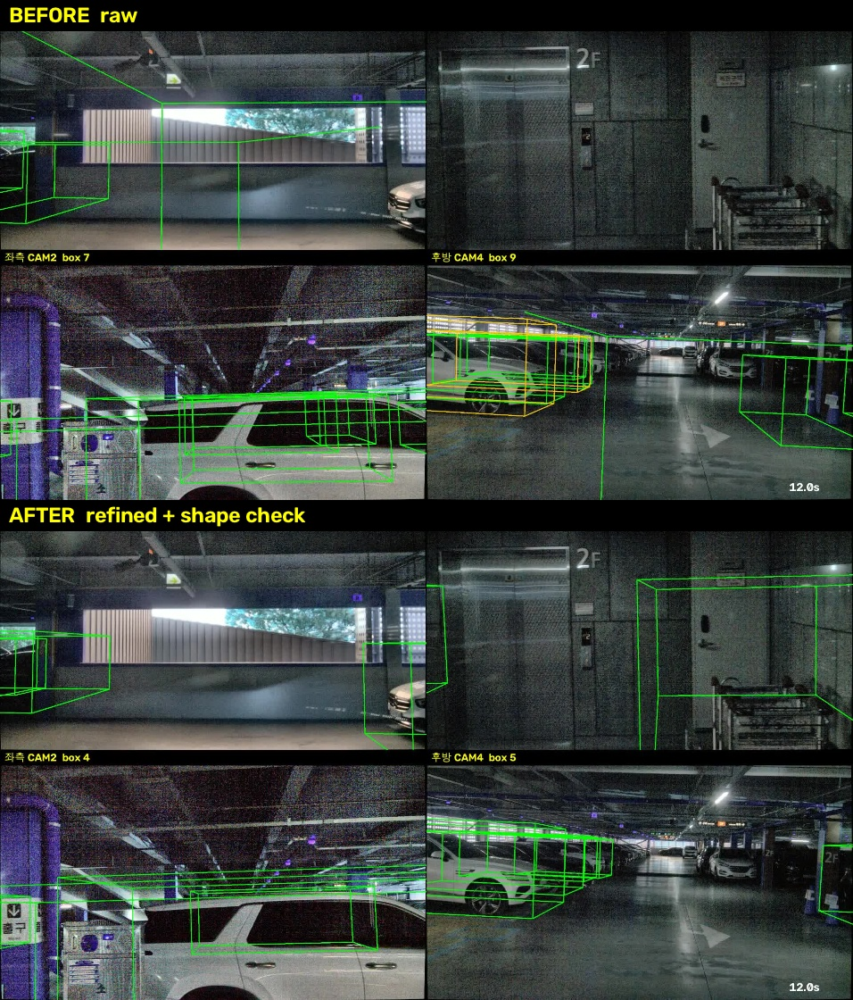
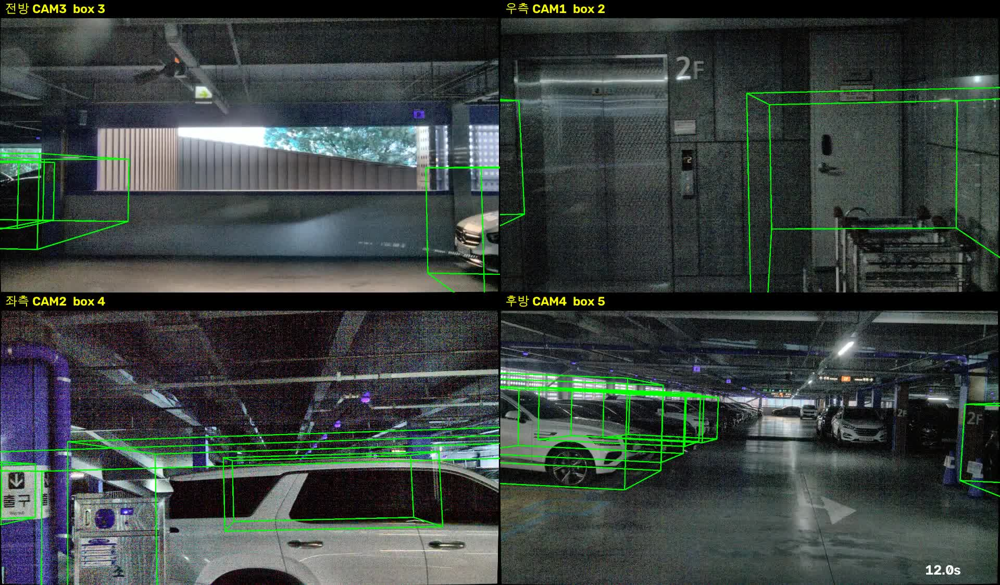

# session_031 — 대구공항 주차장

2026-10-02 17:31:04 녹화. 20 초, free-run. **session_025 와 달리 회전이 들어간 주행**이다.

**4 ~ 11 단계 완료. 12 단계(사람이 박스 수정)부터 남았다.**

전체 작업 순서와 공통 설정은 [최상위 README](../README.md) 와 [`데이터_라벨링/`](../데이터_라벨링) 를 따른다. 이 문서는 **session_031 에만 해당하는 수치와 설정**을 적는다.

---

## 진행 상태

| | 단계 | 상태 | 완료 |
|---|---|---|---|
| 1 | 녹화 | ✅ | 2026-10-02 17:31 |
| 2 | 캘리브레이션 | ⚠️ 공통 (intrinsics 매핑 미검증) | 2026-09-28 |
| 3 | 시간 동기화 | — free-run 으로 촬영 | |
| 4 | 포인트 보정 (deskew + 셔터) | ✅ | 2026-10-04 |
| 5 | 이미지 변환 | ✅ | 2026-10-04 |
| 6 | 클래스 체계 · 메트릭 | ✅ 공통 설정 사용 | 2026-10-03 |
| 7 | 카메라 매핑 | ✅ 공통 설정 사용 | 2026-10-03 |
| 8 | 드리프트 측정 | ✅ | 2026-10-04 |
| 9 | 키프레임 선별 | ✅ | 2026-10-04 |
| **10** | **초안 다듬기** (시간 일관성 · 모양 검사) | ✅ **신설** | 2026-10-04 |
| 11 | 포맷 변환 (ReBound) | ✅ | 2026-10-04 |
| 12 | 툴 설치 + 적재 확인 | ✅ | 2026-10-04 |
| **13** | **3D bounding box 라벨링** | ⬜ **다음 — 사람이 하는 작업** | |
| 14 | 품질 검사 | ⬜ | |
| 15 | 나머지 세션 확장 | ⬜ | |
| 16 | 번호판 · 얼굴 블러링 | ⬜ | |
| 17 | train/val 분할 + 문서화 | ⬜ | |

### 단계 번호가 session_025 와 다르다

**10 단계 "초안 다듬기" 를 새로 넣었다.** 검출기 출력을 그대로 쓰면 같은 차가 프레임마다 다른 박스로 나오고 어떤 프레임에서는 빠진다. 그것을 자동으로 정리하는 단계이며, **포맷 변환 앞에 와야 한다** — 변환 후에 하면 ReBound 데이터를 다시 만들어야 한다.

그래서 11 단계 이후가 하나씩 밀렸고 전체가 16 → 17 단계가 됐다. session_025 는 옛 번호(10 포맷 변환, 11 툴 적재, 12 라벨링)로 기록돼 있다.

---

## 4. 포인트 보정

`run_kiss_icp.py --voxel 0.2 --max-range 25` → `analyze_deskew.py` → `shutter_real.py`

| 항목 | session_031 | (참고) session_025 |
|---|---|---|
| 스캔 | 201 (20.0 초) | 251 (24.9 초) |
| 주행 | 평균 **4.8 km/h**, 최대 6.1 km/h | 4.1 km/h |
| 회전 | **0.45°/스캔, 최대 1.38° (14°/s)** | 0.02°/스캔 (1°/s) |
| 이동 거리 | 26.80 m (시작→끝 직선 23.06 m) | 27.85 m |
| **deskew 효과 — 회전 구간** | **8.3 → 3.3 cm (−60 %)** | 5.9 → 3.4 cm (−42 %) |
| deskew 효과 — 직선 구간 | 5.8 → 3.4 cm | 6.5 → 3.6 cm |
| 구현 검산 (KISS-ICP 내부 보정 대조) | 최대 **0.29 mm** | 0.02 mm |
| 지도 선명도 | 채워진 칸 93,083 → 90,356 (−2.9 %) | −2.8 % |

**회전이 있어서 보정 효과가 session_025 보다 크다.** 20 m 앞 점이 한 스캔 동안 회전만으로 최대 **0.48 m** 끌리고, 점 하나가 최대 **2.02 m** 까지 이동한다 (session_025 는 0.22 m).

### 셔터 실측 위상

| | CAM1 | CAM2 | CAM3 | CAM4 |
|---|---|---|---|---|
| CAM1 대비 | 0 | **+22.8 ms** | **+48.5 ms** | **−28.6 ms** |
| 표준편차 | — | ±0.5 | ±0.5 | ±0.5 |

session_025 (0 / +24.0 / +50.0 / −27.1) 와 거의 같다. `record_freerun.py` 가 카메라를 순차적으로 켜면서 생긴 위상차가 세션마다 재현된다.

### 셔터 보정량

| 구간 | CAM1 | CAM2 | CAM3 | CAM4 |
|---|---|---|---|---|
| 직선 | 1.21 cm | 2.68 cm | 2.60 cm | 6.12 cm |
| **회전** | 2.29 cm | 1.61 cm | 4.89 cm | **9.52 cm** (최대 33.7 cm) |

**후방 카메라(CAM4)가 가장 크다.** 회전할 때 뒤쪽이 가장 많이 휩쓸리기 때문이다. 보정하지 않으면 후방 박스가 10 cm 가까이 어긋난다.

## 5. 이미지 변환

`export_images.py --method 5` (감마 0.35 + CLAHE + 비국소 평균 노이즈 제거), JPEG 801 장.

raw 평균 밝기 **7.9/255** 로 session_025(2.8/255)보다 밝다. 미리보기 영상에서 어두워 보였던 것은 `preview_session.py` 의 기본 보정이 약해서였다.

ReBound 변환은 원본 `.npy` 에서 직접 만들므로 이 폴더에 의존하지 않는다.

## 8. 드리프트 측정

| 시간 간격 | session_031 | (참고) session_025 | 전파 |
|---|---|---|---|
| 1 초 | 2.4 cm | 2.0 cm | ✅ |
| 2 초 | 3.6 cm | — | ✅ |
| **5 초** | **13.7 cm** | 3.4 cm | ❌ |
| 10 초 | 21.3 cm | 13.4 cm | ❌ |
| 15 초 | 18.9 cm | 26.3 cm | ❌ |

**정적 객체 박스를 2~3 초(키프레임 3~4 개)마다 다시 맞춰야 한다.** session_025 의 5 초 기준으로는 모자란다. 회전 구간에서 오도메트리가 더 틀리기 때문이다.

15 초가 10 초보다 작은 것은 누적 오차가 일부 상쇄된 것이다 — 드리프트는 단조 증가하지 않는다.

## 9. 키프레임 선별

규칙은 공통이다 — 직전 키프레임에서 **1 m 이상 움직였거나 3 초가 지나면** 선택.

| | session_031 | (참고) session_025 |
|---|---|---|
| 스캔 | 201 | 251 |
| **키프레임** | **25** | 28 |
| 평균 간격 | 1.09 m (1.01 ~ 1.15) | 1.01 m |
| 정지 구간 중복 | **0 장** | 3 장 |
| 라이다↔카메라 시각차 | 중앙값 29.2 ms, 최대 73.7 ms | 27.6 / 75.1 ms |

session_031 은 정지 구간 없이 바로 주행해서 25 장 전부가 주행 장면이다.

## 10. 초안 다듬기 (신설)

`refine_boxes.py` — 검출기 출력을 시간 일관성과 모양으로 다듬는다.

**왜 필요한가.** 검출기는 키프레임마다 따로 돌아서, 차는 월드 좌표에 고정인데도 박스가 프레임마다 흔들리고 어떤 프레임에서는 아예 빠진다. 시점·가림·거리가 바뀌며 점 패턴이 달라지고, 점수가 임계값 근처를 들락거리기 때문이다.

실측: **박스 690 개가 실제로는 물체 77 개**였다. 1 장에만 나타난 군집은 평균 점수 **0.16**, 10 장 이상 나타난 군집은 **0.33** 이었다 — 깜빡이는 것은 대개 점수가 낮다.

### 하는 일

| | 내용 | 결과 |
|---|---|---|
| 1 | 모든 박스를 ego pose 로 **월드 좌표**에 모음 | 690 개 |
| 2 | **BEV IoU 0.3 이상이면 같은 물체**로 묶음 | 77 군집 |
| 3 | **3 개 키프레임 미만 관측은 버림** | 34 개 버림 → 43 개 |
| 4 | 위치·크기·방향을 **점수 가중 평균** | 깜빡임·흔들림 제거 |
| 5 | 박스 안 점의 **최소 외접 사각형으로 재측정** | 33/43 적용 |
| 6 | **모양 검사** (아래) | 11 개 탈락 → **32 개** |
| 7 | 각 트랙을 **모든 키프레임에 다시 뿌림** | 빠진 자리 **132 개** 채움 |
| 8 | 트랙 ID 부여 | 32 개 |

**최종: 690 → 505 개 (프레임당 27.6 → 20.2), 물체 32 개**

### 모양 검사

관측 횟수로는 벽·기둥이 안 걸러진다 — 일관되게 잘못 검출되기 때문이다. 모양으로 가린다.

| 기준 | 값 | 탈락 |
|---|---|---|
| 차 지붕(2 m) ~ 천장 사이에 점이 있는가 | 비율 > 1.0 → 수직 구조물 | 1 개 |
| 박스 양 끝 너머로 점이 이어지는가 | 비율 > 0.6 → 벽 | 7 개 |
| 차 높이대 점이 충분한가 | 50 개 미만 | 3 개 |

지면 −1.93 m, 천장 3.09 m 는 데이터에서 자동으로 구한다.

**임계값을 두 번 잘못 잡았다.** 처음에는 "지면 위 2.4 m 를 넘는 점" 으로 쟀는데, 실내라 **모든 차 위에 천장이 있어** 43 개 중 38 개가 탈락했다. 차 지붕과 천장 **사이 구간**을 보도록 고쳤다. 그다음 비율 임계값 0.25 도 빡빡해 24 개가 탈락했다 — 실측하니 진짜 차는 0.0~0.5, 기둥은 3 이상이어서 **1.0** 으로 올렸다.

### 전후 비교



좌측 카메라는 7 → 4 개로 겹친 박스가 정리됐고, 후방 카메라는 9 → 5 개이면서 주차열을 따라 고르게 배치됐다. 주황색 오탐(`truck`)도 사라졌다.

### 한계

**정지 물체를 전제한다.** 주행 중인 차가 있는 데이터에는 그대로 쓰면 안 된다. 그리고 벽·기둥 오탐이 모두 걸러지지는 않는다 — 결과는 여전히 **초안**이고 13 단계에서 사람이 확인해야 한다.

## 11. 포맷 변환

`auto_label.py --score 0.1` → `to_rebound.py` → 20 m · 차량 클래스 필터

**검출 결과 (점수 0.1 이상, 전 범위)**

| 클래스 | 개수 | |
|---|---|---|
| car | 1,398 | 차량 |
| pedestrian | **538** | 비차량 — 제외 |
| truck | 222 | 차량 |
| barrier | **144** | 비차량 — 제외 |
| motorcycle | **83** | 비차량 — 제외 |
| traffic_cone / bicycle / 기타 | 92 | 비차량 — 제외 |
| bus / trailer / construction_vehicle | 47 | 차량 |

총 2,477 개 → 20 m 이내 차량만 690 개 (car 582 / truck 106 / trailer 1 / bus 1) → **10 단계 다듬기 후 505 개**.

| | session_031 | (참고) session_025 |
|---|---|---|
| 키프레임당 박스 | **20.2 개** (다듬기 전 27.6) | 37 개 (다듬기 없음) |
| 전체 | **505** | 1,029 |
| 물체(트랙) | **32 개** | — |
| ReBound 용량 | 213 MB | 230 MB |

ReBound 의 박스 `id` 에 트랙 ID(`T001` …)가 들어간다. **프레임이 바뀌어도 같은 차는 같은 ID** 라, 13 단계에서 트랙 ID 를 따로 매길 필요가 없다. `internal_pts` 에는 그 프레임의 점 개수, `data.views` 에는 관측 횟수가 들어 있다.

**박스가 적은 이유**는 통로를 돌면서 **벽이나 빈 공간을 보는 구간이 많기** 때문이다. 아래 영상의 12 초 지점에서 우측 카메라는 엘리베이터 벽만 보여 박스가 0 개다 — 오류가 아니다.

## 12. 툴 적재 확인

```bash
bash 데이터_라벨링/code/run_rebound.sh ~/ros2_ws/cam_lidar_recording/rebound/session_031
```

ReBound 수정 사항은 공통이다 ([`데이터_라벨링/포맷변환.md`](../데이터_라벨링/포맷변환.md)) — `np.asarray` 읽기 전용 배열, 기본 confidence 임계값 50, size 순서 `[W,L,H]`, 드래그 좌표.

작업용 폴더도 session_025 와 같은 구조로 준비했다.

```
rebound/session_031/
├── bounding/0~24/boxes.json            690 개  ← 여기서 작업 (초안 복사본, confidence 100)
├── pred_bounding/0~24/boxes.json       690 개  ← 비교용
└── pred_bounding_original/             690 개  ← 백업
```

**"Toggle Predicted or GT" 를 Ground Truth 로 두고 작업해야 한다.**

### 확인용 영상



[`검출박스_20초.mp4`](검출박스_20초.mp4) (1280×750, 5.6 MB). 원본 해상도는 `~/ros2_ws/cam_lidar_recording/sessions/session_031/boxes_20s.mp4` (1920×1124, 75 MB).

보정 없는 원본 영상은 `~/ros2_ws/cam_lidar_recording/sessions/session_031/full_20s.mp4` 다.

---

## 13 단계부터 할 일

[`데이터_라벨링/작업_방법.md`](../데이터_라벨링/작업_방법.md) 를 따른다. session_031 에만 해당하는 주의점은 하나다.

박스는 10 단계에서 다듬어져 **프레임이 바뀌어도 고정**돼 있다. 그래도 드리프트가 쌓이면 어긋나므로 **재조정 간격을 2~3 초(키프레임 3~4 개)로 좁힌다.** 회전 때문에 드리프트가 session_025 의 4 배다. 직선 구간에서는 덜 틀어지므로, 기계적으로 하기보다 **회전하는 구간을 더 자주 보는** 쪽이 효율적이다.
