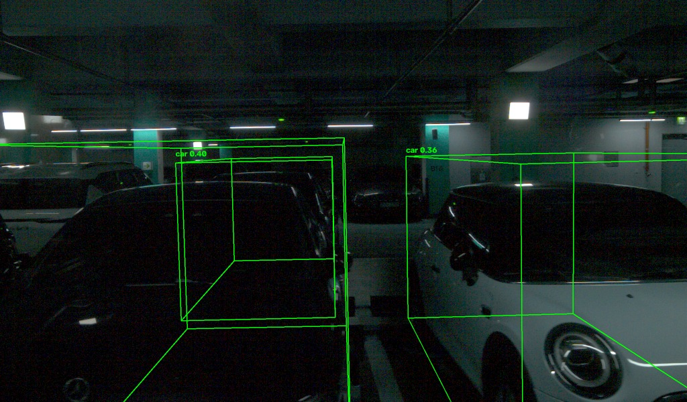

# 자동 라벨링 실험 — nuScenes 사전학습 검출기

2026-10-03. **결과: 된다.** 사람이 처음부터 박스를 그리지 않고, 검출기 초안을 수정하는 방식으로 간다.

---

## 처음 판단이 틀렸던 이유

16 빔이라 사전학습 검출기가 안 먹힐 것으로 봤다. **단일 스캔 기준으로는 맞다** — 20 m 거리의 차에 점이 55 개뿐이다.

놓친 것은 **nuScenes 모델이 10 스윕 누적 입력으로 학습**됐다는 점이다. 우리도 정지 장면이라 ego pose 로 같은 방식으로 누적할 수 있다.

| | 점 수 |
|---|---|
| 단일 스캔 | 약 27,000 |
| **10 스윕 누적** | **약 260,000** |
| nuScenes 입력 | 약 300,000 |

좌표계 관례도 같고(x=앞, y=왼쪽, z=위), 지면 높이도 라이다 기준 **−1.91 m** 로 nuScenes LIDAR_TOP 의 −1.84 m 와 7 cm 차이뿐이다.

군집화로 먼저 시도했으나 실패했다. 주차된 차들이 50 cm 간격으로 붙어 있어 격자를 느슨하게 하면 주차열 한 줄이 **10.3 × 24.2 m** 한 덩어리로 뭉치고, 조이면 차 한 대가 여러 조각으로 부서진다. 느슨/조임 어느 쪽도 차를 분리하지 못했다 (247 ~ 1,318 군집 중 차 크기는 4 ~ 7 개).

---

## 결과 (session_025, 키프레임 28 장, 점수 0.3 이상)

| 클래스 | 개수 | 판정 |
|---|---|---|
| **car** | **341** | 대부분 참 |
| motorcycle | 23 | 오탐 — 기둥·볼라드로 추정 |
| pedestrian | 10 | **오탐** — 8 세션 표본에 사람이 0 명이다 |
| truck | 4 | 확인 필요 |
| bus | 2 | 오탐 — 차 여러 대가 뭉친 것 (13.2 m) |
| construction_vehicle | 1 | 오탐 |

오탐이 약 **9 %**. 프레임당 8 ~ 23 개 검출.

**신뢰할 만한 근거**

- 크기가 4.0 ~ 4.6 × 1.7 ~ 1.9 × 1.6 ~ 1.8 m 로 실제 승용차 치수다
- 위치가 y ≈ ±5 m, ±9.5 m 에 몰려 있다 — 양옆 주차열이다
- 개수가 이미지에서 센 10 ~ 25 대와 맞는다
- 카메라에 투영해 보면 박스가 실제 차 위에 올라간다 ([`figures/자동검출_우측카메라.jpg`](figures/자동검출_우측카메라.jpg))



---

## 환경

CUDA 확장을 직접 컴파일하지 않고 사전 빌드 휠만으로 구성했다. GPU 없이 CPU 로 돌렸다 (키프레임 28 장이라 충분하다).

| | |
|---|---|
| torch | 2.1.0+cpu (mmcv 사전 빌드 휠과 맞추기 위해) |
| mmcv | 2.1.0 — `https://download.openmmlab.com/mmcv/dist/cpu/torch2.1/index.html` |
| mmdet / mmdet3d | 3.2.0 / 1.4.0 |
| numpy | < 2 (torch 2.1 이 numpy 1.x 로 빌드됨) |
| 가중치 | PointPillars nuScenes 24 MB — `hv_pointpillars_fpn_sbn-all_4x8_2x_nus-3d_20210826_104936-fca299c1.pth` |

**CenterPoint 대신 PointPillars 를 쓴 이유**: CenterPoint 는 희소 합성곱이라 CPU 에서 막힐 수 있다. PointPillars 는 pillar scatter 후 2D 합성곱만 쓴다.

**막혔던 것**: `numba` 가 시스템의 오래된 `coverage` 와 충돌했다. `pip install --upgrade coverage` 로 해결.

참고로 이 노트북의 RTX 5060 은 Blackwell(compute 12.0) 이라 GPU 를 쓰려면 torch 2.7+ / cu128 이상이 필요하다. torch 2.11.0+cu128 로 동작을 확인했으나, mmcv 사전 빌드 휠이 그 버전에 없어서 검출에는 CPU 쪽을 썼다.

## 실행

```bash
PYTHONPATH=<mmdet3d 환경> python3 데이터_라벨링/code/auto_label.py <세션> \
    --poses <deskew_on> --keyframes <keyframes.json> \
    --config <pointpillars_hv_fpn_sbn-all_8xb4-2x_nus-3d.py> \
    --checkpoint pp_nus.pth -o <출력>
```

출력은 `detections.json` — 키프레임마다 클래스·점수·중심·크기·yaw.

---

## 작업 계획에 미치는 영향

| | 기존 | 변경 |
|---|---|---|
| 12 단계 | 사람이 차마다 박스를 그린다 | **검출기 초안 → 사람이 수정** |
| 라벨링 툴 | SUSTechPOINTS | **ReBound** — 재라벨링 특화, nuScenes 포맷을 읽는다 |
| 10 단계 포맷 | 미정 | **nuScenes 로 확정** — 검출기 입력과 ReBound 입력이 같은 형식이다 |

사람이 할 일은 "341 개 확인 + 오탐 34 개 삭제 + 놓친 것 추가 + 클래스·트랙 ID 부여" 가 된다.

**주의**: 이 검출 결과는 **초안이지 라벨이 아니다.** nuScenes 로 학습된 모델이라 우리 환경(실내 주차장, 16 빔)에서의 정확도는 검증되지 않았다. 모든 박스를 사람이 확인해야 한다.
