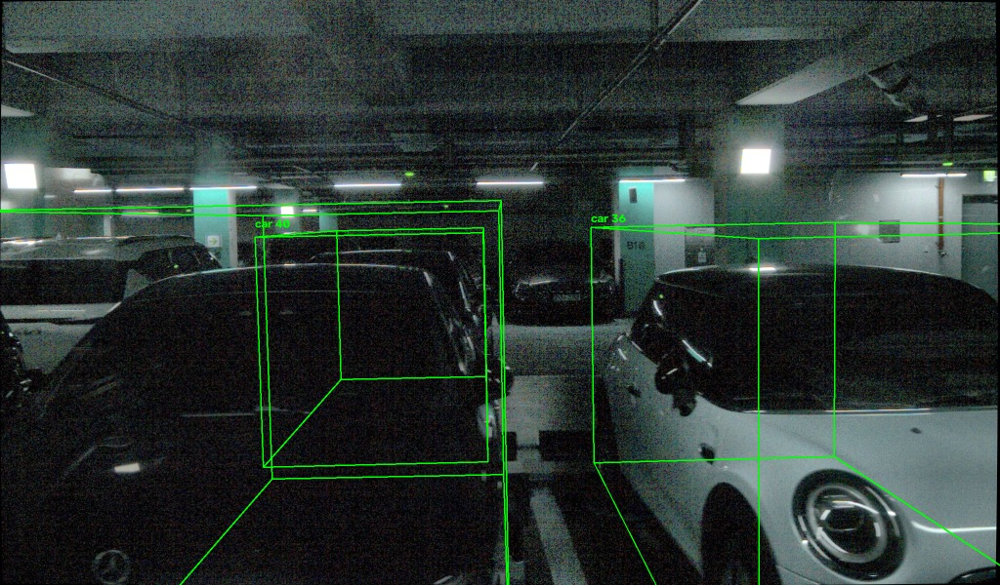
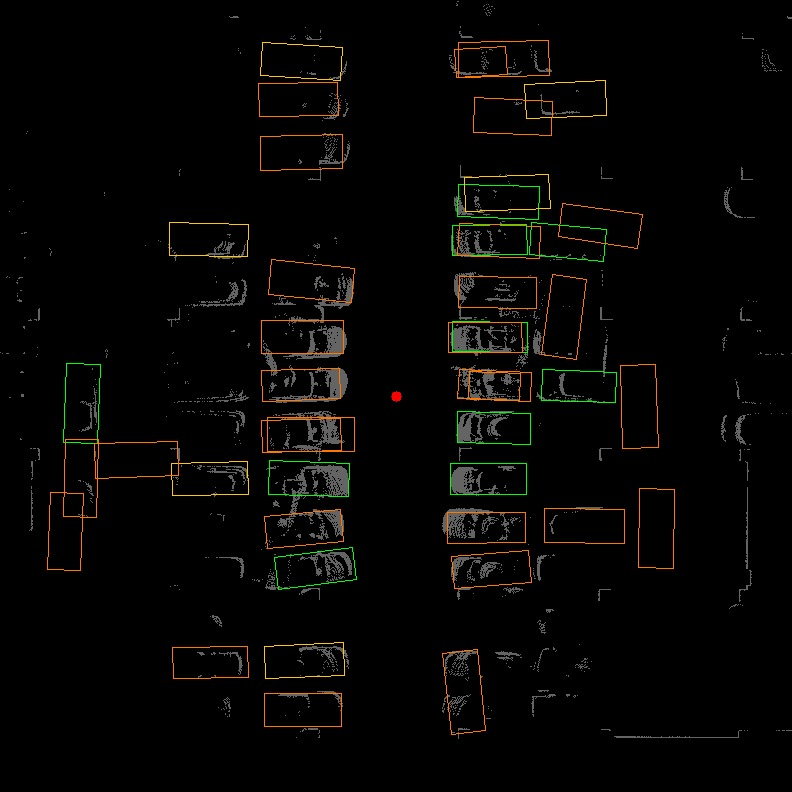

# 포맷 변환 — ReBound

2026-10-03. `session_025` 를 ReBound 포맷으로 변환했다. 변환기는 [`code/to_rebound.py`](code/to_rebound.py).

ReBound 는 nuScenes · Waymo · Argoverse 2 를 자체 공통 포맷으로 바꿔 쓴다. nuScenes 전체 스키마(`sample_data`, `instance`, `scene` …)를 만들 필요는 없고 아래 구조면 된다.

```
rebound/session_025/                     230 MB
├── pointcloud/LIDAR_TOP/0~27.pcd        차량 좌표계, binary PCD
├── cameras/CAM_FRONT|LEFT|RIGHT|BACK/
│     0~27.jpg                           왜곡 보정된 영상
│     extrinsics.json                    translation + 쿼터니언(w,x,y,z)
│     intrinsics.json                    3x3 행렬
├── ego/0~27.json                        전역 좌표계에서의 차량 자세
├── bounding/0~27/boxes.json             정답 — 비어 있다. 사람이 채운다
├── pred_bounding/0~27/boxes.json        검출기 초안 381 개
└── metadata.json, timestamps.json
```

## 변환에서 결정한 것

| 항목 | 결정 | 이유 |
|---|---|---|
| 차량 좌표계 | **라이다 좌표계를 그대로 쓴다** | 우리 리그에는 별도 차량 좌표계가 없다. 라이다 extrinsic 은 항등, 카메라 extrinsic 은 `T_cam_lidar` 의 역행렬 |
| 포인트클라우드 | **10 스윕 누적** (약 26 만 점) | 단일 스캔(2.7 만)보다 10 배 촘촘해 사람이 차를 알아보기 쉽다. 검출기가 본 것과 같은 입력이기도 하다 |
| 이미지 | **왜곡 보정**해서 저장 | `intrinsics.json` 에 왜곡계수 칸이 없다 — ReBound 는 보정된 영상을 전제한다 |
| 박스 원점 | 바닥중심 → **중심** 으로 변환 | mmdet3d 는 바닥중심, ReBound 는 중심을 쓴다 |
| 검출 결과 | `bounding` 이 아니라 **`pred_bounding`** | 사람이 확인하기 전에는 정답이 아니다 |

## 검증

**ReBound 출력 파일만** 읽어 박스를 이미지에 역투영했다. 원본 데이터를 쓰지 않은 이유는, 변환에서 쿼터니언·외부 파라미터·중심 기준이 틀어져도 숫자는 그럴듯해 보이기 때문이다.



박스가 실제 차 위에 정확히 올라간다. 추가로 확인한 수치:

- 박스 바닥 z = **−1.91 m** — 따로 측정한 지면 높이와 일치
- 박스 yaw ≈ **−89°** — 주행로에 수직인 주차 차량
- `CAM_FRONT` translation `[0.669, −0.007, −0.281]` — `extrinsics_all.yaml` 의 `position_xyz` 와 일치

## 실행

```bash
python3 데이터_라벨링/code/to_rebound.py <세션> \
    --poses <deskew_on> --keyframes <keyframes.json> \
    --detections <detections.json> -o <출력>
```

출력은 저장소가 아니라 `~/ros2_ws/cam_lidar_recording/rebound/` 에 둔다 (세션당 230 MB).

---

## ReBound 실행

```bash
git clone https://github.com/ajedgley/ReBound.git ~/Documents/ReBound
bash 데이터_라벨링/code/run_rebound.sh                      # 기본: session_025
bash 데이터_라벨링/code/run_rebound.sh <다른 데이터셋 경로>
```

저장소는 Python 3.8 + `open3d 0.14.1` + `numpy 1.22` 를 요구하지만(`src/Pipfile`), 이 노트북의 **Python 3.10 + open3d 0.20 + numpy 1.26 으로도 실행된다**. 2026-10-03 확인: Vulkan 백엔드로 RTX 5060 에서 창이 뜨고 데이터 적재 중 오류가 없었다.

`requirements.txt` 가 없고 `src/Pipfile` 만 있다. 전체 핀을 따르면 jupyter 등 불필요한 것까지 깔리므로, 실제로 필요한 것만 설치한다 — `open3d`, `nuscenes-devkit`, `pyquaternion`, `matplotlib`, `opencv-python`, `numpy`.

## ReBound 버그 수정 (2026-10-03)

프레임 3 으로 넘기는 순간 창이 꺼지고 다음 오류가 났다.

```
overload resolution failed - img marked as output argument,
but provided numpy array marked as readonly
```

원인은 ReBound 코드다. `np.asarray(Image.open(...))` 는 **읽기 전용 배열**을 돌려주는데, 그 위에 `cv2.line` / `cv2.putText` 로 박스를 그리려 해서 막혔다.

프레임 0~2 에서 멀쩡했던 이유는 그 프레임들의 박스가 카메라 화면에 하나도 걸리지 않아 **그리기 자체가 실행되지 않았기** 때문이다. 박스가 화면에 들어오는 첫 프레임에서 터진다.

**수정**: 네 곳을 `np.array` 로 바꾼다 (쓰기 가능한 복사본).

| 파일 | 줄 |
|---|---|
| `src/lct.py` | 121, 424 |
| `src/annotation_editing.py` | 70, 1058 |

```bash
cd ~/Documents/ReBound/src
sed -i 's/self\.image = np\.asarray(Image\.open(self\.image_path))/self.image = np.array(Image.open(self.image_path))/' lct.py annotation_editing.py
sed -i 's/self\.image = np\.asarray(self\.image)/self.image = np.array(self.image)/' lct.py annotation_editing.py
```

예전 numpy·Pillow 에서는 `np.asarray` 가 쓰기 가능한 배열을 주기도 했다. ReBound 의 `Pipfile` 이 `numpy 1.22` 로 고정돼 있는 이유로 보인다.

## 검출 임계값

처음에는 점수 0.3 이상만 담았더니 프레임당 12~23 개뿐이라, 양옆에 주차된 차 대부분이 박스 없이 보였다. 검출기는 더 찾아냈지만 **파일에 없으면 ReBound 의 confidence 슬라이더로도 꺼낼 수 없다.**

| 점수 기준 | 프레임당 검출 |
|---|---|
| 0.3 이상 | 12 ~ 23 |
| 0.2 이상 | 40 ~ 56 |
| 0.1 이상 | 160 ~ 200 |

**0.1 이상 + 차량 클래스만** 으로 다시 만들었다 — 프레임당 93 개, 전체 2,613 개 (car 2,013 / truck 409 / bus 63 / construction_vehicle 86 / trailer 42).

비차량(pedestrian 833, motorcycle 548, barrier 453)은 **버렸다.** 8 세션 표본에 사람이 0 명인 것을 확인했으므로 전부 기둥·볼라드 오탐이고, 우리 평가 클래스(car·truck·bollard)에도 없다. 지우는 수고를 줄이는 편이 낫다.

뒷줄에 주차된 차의 점수가 낮은 이유는 앞 차에 가려 점이 적게 잡히기 때문이다. nuScenes 모델이 야외 주행 장면으로 학습돼 주차장처럼 차가 빽빽한 구성에 익숙하지 않은 것도 있다.

## 박스가 안 보이던 두 번째 원인 — ReBound 기본 임계값 50

임계값을 0.1 로 낮춰 프레임당 93 개를 넣었는데도 화면에는 몇 개만 보였다. 가려진 뒷차에는 박스가 있고 바로 옆 차에는 없는 이상한 모습이었다.

원인은 `lct.py:90` 의 `self.min_confidence = 50` 이다. 우리 검출 점수는 **10 ~ 55** 범위라 대부분이 기본값에 잘린다. 뒷차에 박스가 보였던 것은 그 차가 우연히 50 을 넘었기 때문이지, 검출 품질 때문이 아니다.

**수정**: 기본값을 10 으로 내린다.

```bash
sed -i 's/self\.min_confidence = 50/self.min_confidence = 10/' ~/Documents/ReBound/src/lct.py
```

창에서 "Specify confidence threshold" 로 그때그때 바꿀 수도 있다.

### 검출 상태 (session_025 키프레임 15)



가운데 빨간 점이 자차, 회색이 차 높이대(지면 +0.3 ~ +1.8 m) 의 라이다 점, 박스는 초록 ≥0.3 · 노랑 ≥0.2 · 주황 ≥0.1 이다. **양쪽 주차열의 차 대부분에 박스가 있다** — 다만 점수가 낮아 주황이 많다.

### 짚고 넘어갈 것

원인을 찾기까지 두 가지 헛다리를 짚었다. 기록해 둔다.

| 가설 | 검증 | 결과 |
|---|---|---|
| 실내 천장이 검출을 방해한다 | 천장 제거 후 재검출 | **아니다.** 전체 검출은 163 → 236 으로 늘지만 가까운 검출(<10 m)은 32 → 23 으로 오히려 줄었다 |
| 점이 너무 많아 `max_voxels=30000` 을 넘겨 버려진다 | pillar 수 계산 | **아니다.** 26 만 점이지만 pillar 는 10,178 개로 한도 안이다 |

## 다른 주의점

`lct.py:201` 이 `self.pred_frames = len(bounding 폴더 수) - 1` 로 계산한다. 우리 28 프레임에서는 27 이 되어 **마지막 프레임의 클래스가 체크박스 목록에 등록되지 않는다.** 모든 프레임에 같은 클래스가 나오면 문제가 드러나지 않는다.

## 라벨링 범위를 20 m 로 축소 (2026-10-03)

임계값을 고친 뒤 박스가 다 보이자, 이번에는 **모든 차에 박스가 쳐져 화면이 복잡해졌다.** 프레임당 93 개였다.

범위를 정해야 했다. 실제 분포를 보면 주차 구조가 선명하다.

| y 위치 | 박스 수 (20 m 이내 car) | 의미 |
|---|---|---|
| **±5 m** | 396 | 첫 번째 줄 — 통로 양옆 |
| ±9 ~ 11 m | 212 | 두 번째 줄 |
| ±12 m 이상 | 34 | 세 번째 줄 |

| 거리 제한 | 프레임당 | 전체 |
|---|---|---|
| 10 m | 16 | 446 |
| 15 m | 31 | 857 |
| **20 m** | **37** | **1,029** |
| 30 m | 51 | 1,426 |

**20 m 로 정했다.** 근거는 점 밀도다 — 20 m 에서 차 한 대에 55 점, 30 m 에서 25 점이다. 30 m 면 세로로 1~2 링만 걸려 방향과 높이를 라이다로 정할 수 없다.

**"가까운 줄만" 같은 기준은 쓰지 않는다.** 범위 안을 빠뜨리면 모델이 그 객체를 맞게 찾아도 정답에 없어 오탐으로 집계된다. 범위를 좁히는 것은 괜찮지만 그 안은 빠짐없이 해야 한다.

작업량은 박스 1,029 개지만 **조작 횟수는 그보다 훨씬 적다.** 주차된 차는 고정이라 한 번 그리면 ego pose 로 전파된다. 28 m 주행에 양옆 첫째·둘째 줄이면 실제 차는 50~80 대이고, 5 초마다 재조정(8 단계)을 포함해 200~300 번 수준이다.

`pred_bounding` 도 20 m 이내 차량 클래스만 남겼다 — 프레임당 37 개 (car 842 / truck 146 / construction_vehicle 41).

## 박스가 90° 돌아가 있던 원인 — size 순서 (2026-10-03)

차가 가로로 주차돼 있는데 박스는 세로로 그려졌다. **내 변환 버그다.**

`utils/dataformat_utils.py:147` 에 명시돼 있다.

> `sizes: [n, 3] list representing **W, L, H** of box`

ReBound 는 **[폭, 길이, 높이]** 순서(nuScenes 관례)인데, mmdet3d 는 `dx`(길이), `dy`(폭) 순이다. 그대로 넣어서 4.2 × 1.7 짜리 차가 1.7 × 4.2 로 들어갔다.

`lct.py` 렌더링에서 되바꾸는 코드가 단서였다.

```python
size[0] = box[SIZE][1]    # Open3D wants sizes in L,W,H
size[1] = box[SIZE][0]
```

**회전 공식은 맞았다.** mmdet3d 의 `LiDARInstance3DBoxes.corners` 와 내가 계산한 코너를 대조해 **최대 차이 0.0000 m** 로 확인했다. 틀린 것은 size 하나뿐이었다.

**수정**: `to_rebound.py` 에서 `"size": [w, l, h]` 로 쓴다.


ReBound 와 같은 방식으로(`extent = (size[1], size[0], size[2])`) 다시 그린 평면도. 박스가 주차된 차의 점 덩어리와 방향·크기가 맞는다.

### 교훈

앞서 "ReBound 출력 파일만 읽어 역투영" 으로 검증했는데도 이 버그를 놓쳤다. **내가 쓴 규칙(`[l, w, h]`)으로 다시 읽었기 때문**이다. 포맷 변환을 검증할 때는 내 가정이 아니라 **대상 도구의 문서와 렌더링 코드**를 기준으로 읽어야 한다.
